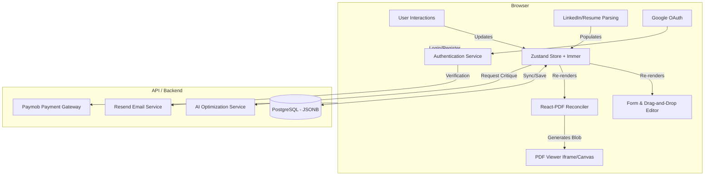

# Project Architecture & Technical Stack

## 1. High-Level Architecture
The CV Maker is designed as a **Client-Side First** application. The heavy lifting of document rendering, state management, and interactivity happens in the user's browser. The backend primarily serves as a synchronization layer, authentication provider, payment processor, and AI proxy.

The core architectural principle is **"Single Source of Truth"**: The Resume State object drives both the Editor UI and the PDF Renderer simultaneously, ensuring 100% visual consistency ("What You See Is What You Get").



---

## 2. Technology Stack (Implemented)

### Frontend (The Core)
*   **Framework:** **React** (v19) with **Vite** for fast HMR.
*   **Language:** **TypeScript** (Strict mode).
*   **Styling:** **Tailwind CSS** (v4) for the Editor UI + **StyleSheet** for `@react-pdf/renderer` styling.
*   **State Management:** **Zustand** (v5) combined with **Immer** (v11).
    *   *Reasoning:* Redux is too verbose for this; Context API creates too many re-renders. Zustand is lightweight, and Immer allows for easy state mutations and future undo/redo capability.
*   **Form Handling:** **React Hook Form** (v7) + **Zod** (v4).
    *   *Reasoning:* Performance is critical when every keystroke could potentially trigger a PDF re-render. RHF's uncontrolled inputs reduce render trashing.
*   **Drag & Drop:** **@dnd-kit/core** & **@dnd-kit/sortable** (v10).
    *   *Reasoning:* Modern, accessible, and lightweight compared to `react-beautiful-dnd`.
*   **PDF Engine:** **@react-pdf/renderer** (v4).
    *   *Reasoning:* Allows writing PDFs using React primitives (`<View>`, `<Text>`, `<Page>`).
*   **Routing:** **React Router DOM** (v7).
*   **Authentication UI:** **@react-oauth/google** for Google Sign-In button.
*   **Icons:** **Lucide React**.

### Backend (Support Layer)
*   **Runtime:** **Node.js**.
*   **Framework:** **Express** (v5).
*   **Database:** **PostgreSQL** (v15).
    *   *Why Postgres over Mongo?* We need relational data for Users, Subscriptions, and authentication, but `JSONB` columns allow us to store the complex, nested Resume object schema-lessly while retaining the ability to query it if needed.
*   **ORM:** **Prisma** (v5).
*   **AI Integration:** **OpenAI SDK** with OpenRouter-compatible endpoints.
*   **Authentication:** **Custom implementation**:
    *   Email/Password with bcrypt hashing.
    *   JWT tokens for session management.
    *   Google OAuth via `google-auth-library`.
*   **Email Service:** **Resend** for transactional emails (verification, etc.).
*   **Payments:** **Paymob** (optimized for Egyptian/MENA market).
*   **PDF Parsing:** **pdf-parse** for LinkedIn PDF import.
*   **Security:** **Helmet** for HTTP headers, **CORS** configured.
*   **Deployment:** **Docker Compose** with PostgreSQL, Server, and Client services.

---

## 3. Data Model & State Strategy

### The Resume Schema (TypeScript Interface)
The entire application revolves around this structure. It must be versioned to allow for future template upgrades.

```typescript
type ResumeSchema = {
    meta: {
        templateId: string; // 'modern' | 'minimalist' | 'standard'
        themeConfig: {
            primaryColor: string;
            fontFamily: string;
            spacing: 'compact' | 'standard' | 'relaxed';
        };
    };
    profile: {
        fullName: string;
        email: string;
        phone: string;
        location: string;
        url: string;
        summary: string;
    };
    sections: {
        id: string;
        type: 'experience' | 'education' | 'custom';
        title: string;
        isVisible: boolean;
        columns: number;
        items: any[];
    }[];
}
```

### Rendering Strategy: The "Split-World" Approach
A major challenge is that HTML CSS (for the editor) and PDF primitives (for the output) are different.
*   **Common Data:** Both "worlds" consume the same `ResumeSchema` prop.
*   **Editor Components:** Render HTML `<div>`, `<input>`, and Tailwind classes.
*   **PDF Components:** Render `<View>`, `<Text>`, and React-PDF styles.
*   **Shared Logic:** Helper functions for things like date formatting, strict string optimization, and bullet point processing are shared.

---

## 4. Key Technical Implementation Details

### A. Real-Time PDF Preview
Rendering a PDF on every keystroke allows for a perfect preview but is performance-heavy.
*   **Debouncing:** The PDF generation trigger is debounced (600ms after user stops typing).
*   **Memoization:** Heavy components in the PDF document are memoized (`React.memo`) to prevent regenerating pages that haven't changed.

### B. LinkedIn Import / Data Loading Strategy
Since server-side scraping is blocked by LinkedIn, we adopt a file-based approach:
1.  **File-Based Import (Implemented):**
    *   User uploads `Profile.pdf` (exported from LinkedIn).
    *   Backend uses `pdf-parse` -> LLM Sanitization -> `ResumeSchema`.
2.  **Future Enhancement (Client-Side Extension):**
    *   A separate Chrome Extension reads DOM data -> POSTs JSON to our API.

### C. Authentication System (Implemented)
*   **Email/Password:** Registration with email verification via Resend.
*   **Google OAuth:** One-click sign-in with automatic email verification.
*   **JWT Tokens:** Stateless authentication with configurable expiry.
*   **Protected Routes:** Client-side route guards for authenticated pages.

### D. Payment Integration (Implemented)
*   **Paymob Gateway:** Egyptian payment provider supporting local payment methods.
*   **Premium Features:** Gated behind payment (additional templates, unlimited exports, AI analysis).

### E. ATS Optimization (The "Invisible" Layer)
*   **Text Layer:** `@react-pdf/renderer` naturally creates text-selectable PDFs (not images), which is Step 1 for ATS.
*   **Clean Templates:** All 3 templates (Modern, Minimalist, Standard) are designed without columns or graphics that confuse parsers.
