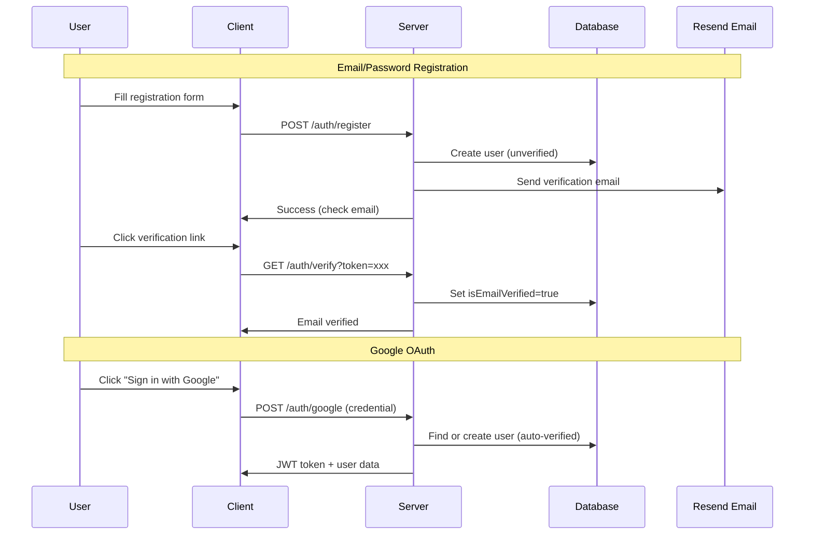

# Database Schema (Prisma / PostgreSQL)

Based on the [Architecture](./architecture.md) and [Idea](./idea.md) documents, we use **PostgreSQL** with **Prisma ORM**. The key design decision is using `JSONB` for the resume content to allow for schema evolution without painful migrations.

## Schema Definition (`schema.prisma`)

```prisma
generator client {
  provider = "prisma-client-js"
}

datasource db {
  provider = "postgresql"
  url      = env("DATABASE_URL")
}

/**
 * User Model
 * Supports both Email/Password and Google OAuth authentication.
 * Includes email verification and payment tracking.
 */
model User {
  id                 String    @id @default(uuid())
  email              String    @unique
  
  // Auth: Email/Password
  password           String?   // Hashed via bcrypt (optional if Google-only)
  
  // Auth: Google OAuth
  googleId           String?   @unique
  avatar             String?
  
  // Email Verification
  isEmailVerified    Boolean   @default(false)
  verificationToken  String?   @unique
  verificationExpiry DateTime?
  
  // Payment Info (Paymob)
  paymobOrderId      String?   @unique  // For pending/completed order tracking
  
  // Payment Info (Stripe - Future)
  stripeCustomerId   String?   @unique
  
  // Premium Status
  isPremium          Boolean   @default(false)
  
  // Relations
  resumes            Resume[]

  createdAt          DateTime  @default(now())
  updatedAt          DateTime  @updatedAt
}

/**
 * Resume Model
 * The "Single Source of Truth" for the resume data.
 */
model Resume {
  id        String   @id @default(cuid())
  
  title     String   @default("Untitled Resume")
  
  // The magic field: Stores the entire ResumeSchema interface as a JSON object.
  // This includes sections, layout config, theme, profile, and content.
  // Type: ResumeSchema (defined in architecture.md)
  content   Json     
  
  // Sharing & Visibility
  isPublic  Boolean  @default(false)
  shareKey  String?  @unique // Random string for sharing link (e.g. /cv/share/xyz123)
  
  // Ownership
  userId    String
  user      User     @relation(fields: [userId], references: [id], onDelete: Cascade)

  createdAt DateTime @default(now())
  updatedAt DateTime @updatedAt

  @@index([userId])
}
```

## Detailed Field Explanations

### User Model

#### `User.password`
*   **Type:** Optional String (hashed via bcrypt).
*   **Why Optional:** Users who sign up via Google OAuth don't need a password.

#### `User.googleId`
*   **Type:** Optional String (Google's unique user ID).
*   **Why:** Allows linking a Google account to an existing email account.

#### `User.isEmailVerified`
*   **Type:** Boolean, defaults to `false`.
*   **Why:** Email/password users must verify their email before logging in. Google OAuth users are auto-verified since Google already verified their email.

#### `User.verificationToken` & `User.verificationExpiry`
*   **Type:** String and DateTime.
*   **Why:** Secure email verification flow. Tokens expire after 24 hours.

#### `User.paymobOrderId`
*   **Type:** Optional String.
*   **Why:** Track pending and completed Paymob orders for premium upgrades.

### Resume Model

#### `Resume.content` (JSONB)
*   **Type:** `Json` (Mapped to `ResumeSchema` in TypeScript).
*   **Why:** Resume structures are highly nested (Experience -> Bullets) and variable (Custom Sections).
*   **Benefit:** We can add new fields to the Resume Schema (e.g., adding a "Project URL" field) without running a database migration. The Frontend handles the structure; the Database just stores it.

#### `Resume.shareKey`
*   **Type:** Optional String.
*   **Why:** Public sharing needs a secure, obscure URL, not just the sequential ID. Future feature for shareable resume links.

## Authentication Flow Summary


